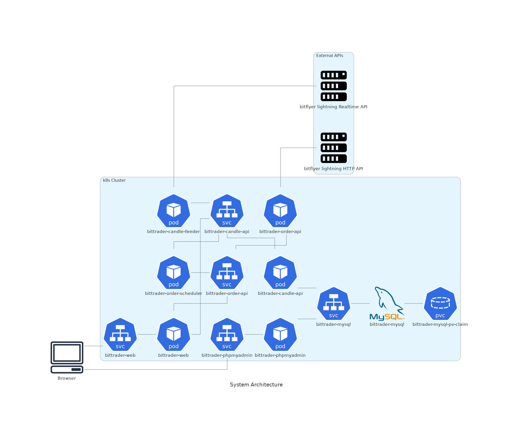

# bittrader
my bitcoin trader

[](https://github.com/ken-tunc/bittrader/actions/workflows/build.yml)
[](https://codecov.io/gh/ken-tunc/bittrader)

## Deploy
Deploy application to Kubernetes cluster
```
$ kubectl apply -f ./k8s
```

## Build docker images
```
$ ./gradlew bootBuildImage
```

## System architecture

